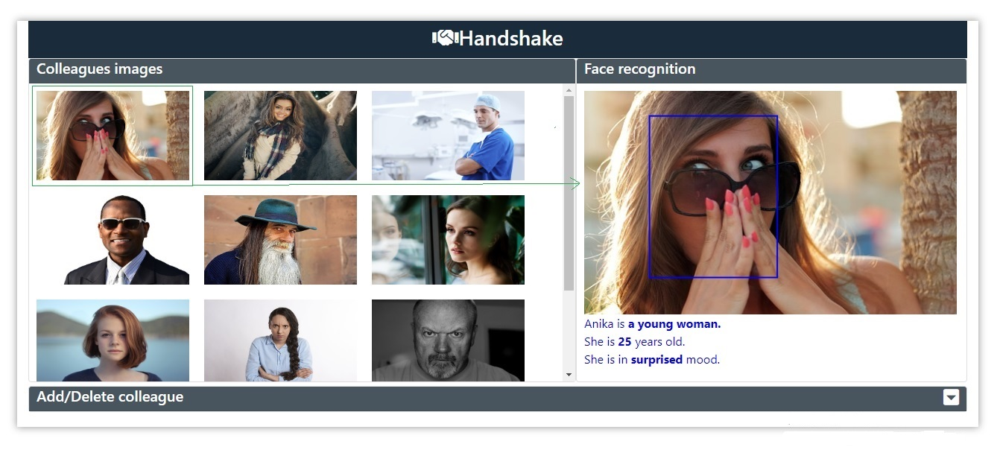
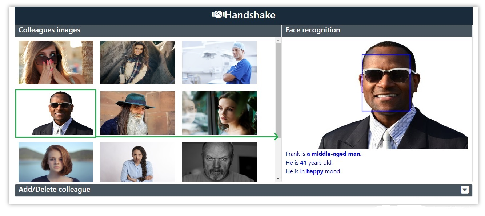

# Handshake

Handshake is a face recognition and description application. It is used to identify a person. This application can detect the person age, age-group (child, young, middle-age and old), gender and emotional status (happy, angry, surprised, neutral etc.).

This is a web application based on PHP, jQuery and plain Javascript.

This application also contains add and delete image.

<h2>Screenshot-01</h2>

<h2>Screenshot-02</h2>

